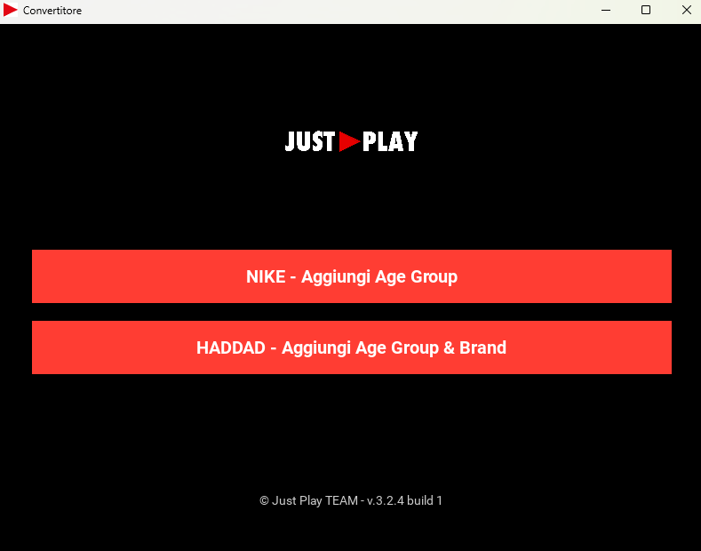

# 🧠 Just Play Excel Converter

**Version: v3.2.4 build 1**

A desktop application built with **Python** and **Kivy**, designed to simplify processing of order confirmations from **NIKE** and **HADDAD**.  
It automatically adds the appropriate *Age Group* and optionally *Gender/Brand* columns to supplier Excel files.

---

## 🖥️ Key Features

- 👟 **NIKE** – Adds the `Age Group` column based on the product gender code.
- 🧢 **HADDAD** – Automatically decodes article codes and adds:
  - `Age Group`
  - *(optional)* `Gender`
- 📂 Excel files are read from the `excel/` folder and overwritten after processing.
- 🎨 Simple and elegant UI with dark theme and intuitive buttons.


## 🖼️ Screenshot

Below is a preview of the application interface:



---

## 📁 Project Structure
├── main.py # Main application script
├── excel/ # Folder for Excel files to be processed
├── assets/
│ └── logo.png # Displayed logo in the GUI
├── favicon.png # App icon

---

## ▶️ How to Run

Make sure dependencies are installed:

```bash
pip install kivy pandas openpyxl


- Then launch the app with:
```bash
python main.py

